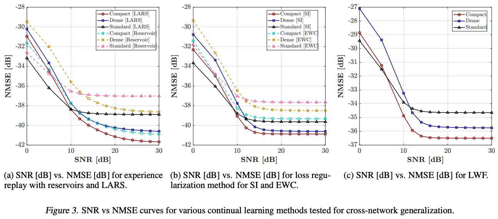
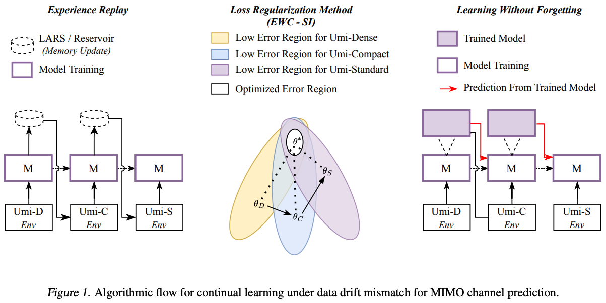

# Continual Learning for Wireless Channel Prediction [ICML 2025]

This directory contains scripts for continual learning experiments on channel prediction tasks, as accepted to the [ICML 2025].

[](https://openreview.net/forum?id=xzaGCSM7Sv&nesting=2&sort=date-desc)  [](https://arxiv.org/abs/2506.22471)




## Folder Structure

```text
continual/
├── lwf.py            # Learning without Forgetting (LwF)
├── er_updated.py     # Experience Replay (ER) strategies: reservoir & LARS
├── ewc_updated.py    # Elastic Weight Consolidation (EWC & EWC‑SI)
└── (imports from root: dataloader.py, model.py, loss.py, utils.py)
```

## Requirements

- Python >=3.12 (as specified in `pyproject.toml`)
- uv (for dependency management)

## Installation

This project uses Poetry for dependency management, with `pyproject.toml` and `uv.lock` provided in the root directory. Install dependencies via:

```bash
uv install
```

If you prefer pip, you can also use:

```bash
pip install -r requirements.txt
```

## Data Preparation

Place the three preprocessed `.mat` channel matrices in `dataset/outputs/`:

- `umi_fixed_compact_8Tx_2Rx.mat` (Task S1)
- `umi_fixed_dense_8Tx_2Rx.mat` (Task S2)
- `umi_fixed_standard_8Tx_2Rx.mat` (Task S3)

Each script will load all three tasks automatically.

## Baseline Training

This repository also includes baseline channel-prediction experiments. All baseline scripts live at the root level alongside shared modules.

```text
baseline/
├── main.py            # Single-task training and evaluation on S1 (compact)
├── nmse.py            # NMSE evaluation for GRU, LSTM, and Transformer models
├── nmse_run_all.sh    # Batch evaluation on all scenarios for each model
├── run_everything.sh  # Quick commands for running main.py with different architecture
└── (shared: dataloader.py, model.py, loss.py, positionalembedder.py, utils.py)
```

### Sample Commands

#### 1. Train & evaluate on compact (S1) with LSTM

```bash
python main.py --ext mat --model_type LSTM
```

#### 2. Evaluate pre-trained models across scenarios

```bash
# GRU on all pairs
bash nmse_run_all.sh

# Or selectively:
python nmse.py --ext mat --model_type GRU \
  --file_path "../dataset/outputs/umi_compact_8Tx_2Rx." \
  --test_file_path "../dataset/outputs/umi_dense_8Tx_2Rx."
```

#### 3. Quick run with different architectures

```bash
bash run_everything.sh
```

## Continual Training


### 1. Learning without Forgetting (LwF)

```bash
python lwf.py \
  --model_type LSTM \
  --strategy lwf
```

### 2. Experience Replay (ER)

```bash
# Reservoir sampling replay
python er_updated.py \
  --model_type LSTM \
  --sampling reservoir

# LARS (loss‑aware) replay
python er_updated.py \
  --model_type LSTM \
  --sampling lars
```

Use `--use_distill` and `--lambda_bc` flags in `er_updated.py` to enable CLEAR‑style distillation.

### 3. Elastic Weight Consolidation (EWC)

```bash
# Standard EWC
python ewc_updated.py \
  --model_type LSTM \
  --strategy ewc

# Synaptic Intelligence (EWC‑SI)
python ewc_updated.py \
  --model_type LSTM \
  --strategy ewc_si
```

## Script Descriptions

- **lwf.py**: Implements the Learning without Forgetting strategy. Trains sequentially on tasks S1→S2→S3, preserving knowledge via distillation.
- **er\_updated.py**: Implements Experience Replay with two sampling strategies:
  - **reservoir**: uniform reservoir sampling
  - **lars**: loss‑aware replacement (LARS) Optionally supports behavioral‑cloning distillation (`--use_distill`).
- **ewc\_updated.py**: Implements two regularization‑based methods:
  - **ewc**: Elastic Weight Consolidation with Fisher information
  - **ewc\_si**: Synaptic Intelligence variant updating importance online

## Outputs

Each training script prints progress via `tqdm` and, upon completion, evaluates masked‑NMSE on test sets S1, S2, and S3. Results are saved to CSV:

- ER results: `<sampling>_<model_type>_nmse_results.csv`
- LwF results: `lwf_<model_type>_nmse_results.csv`
- EWC results: `<strategy>_<model_type>_nmse_results.csv`

Example CSV:

```csv
Task,SNR,NMSE Masked,NMSE (dB)
S1_Compact,0,0.0123,-19.10
...
```

## Citation

If you use this code, please cite:

```bibtex
@inproceedings{mohsin2025continual,
  title={Continual Learning for Wireless Channel Prediction},
  author={Mohsin, Muhammad Ahmed and Umer, Muhammad and Bilal, Ahsan and Jamshed, Muhammad Ali and Cioffi, John M},
  booktitle={ICML 2025 Workshop on Machine Learning for Wireless Communication and Networks (ML4Wireless)}
}
```

